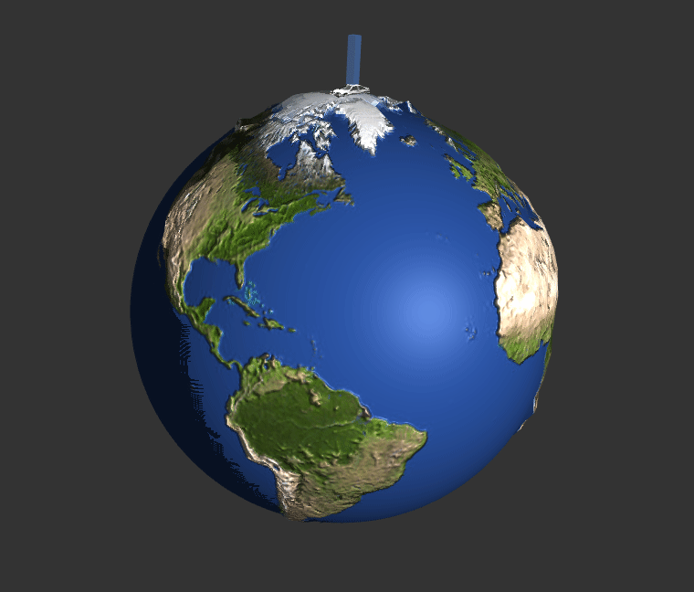
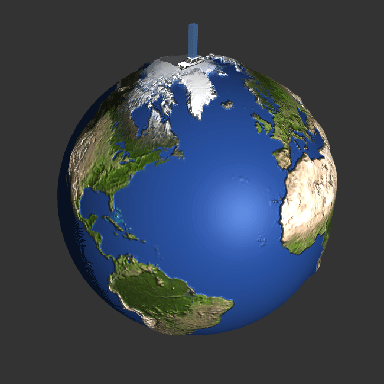
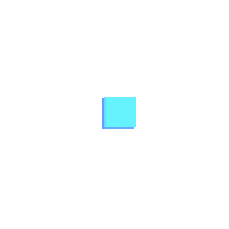

# Gym_CPP

## C/C++ Gym for AI. With C/C++ Torch (Libtorch or PyTorch in C++))

The Gym implemented CartPole for 1D and 2D continuous.

1D _action_: `[ -1 < x < 1 ]`

1D _state_ : `[ position, velocity, angle, angular velocity ]`

1D _done_ : `-threshold > position` or `threshold < position` or `-ang_thres > angle` or `ang_thres < angle`

2D _action_: `[ -1 < x < 1, -1 < y < 1 ]`

2D _state_ : `[ position_x, velocity_x, angle_x, angular velocity_x, position_y, velocity_y, angle_y, angular velocity_y ]`

The example shown below uses vision-based version of 2D continuous CartPole.

The CartPole VisionContinuous does not limit the cart position and linear velocity. So the cart is moving in an infinite plane or sphere (centripedal force neglected) as shown by the example. The `state` of the cart is transferred to an image for RL models.
The vision-based version cannot be used directly. A callback renderer function is needed which can be found in `gym_gl.cpp`.
The renderer depends on `glfw` and `glad` libraries which are also include in this repository.
Example usage see below.

Example : `Accumulated Rewards = 500` (Trained with Soft Actor-Critic)

 

Example : `Accumulated Rewards = 500` (Trained with Proximal Policy Optimization V2)



** _The recording FPS is 30+ Hz, so the GIFs are not exactly with 500 frames._

A `state` is an top-view image of the CartPole (128x128) which composes 4 channels, 2 for current frame and 2 for previous frame.

A frame consist of 1 ambient channel (Blue) and 1 depth channel (Green) all in range `[0, 255]`. 

The following example shows ONLY the current-frame (1st & 2nd channels of the current `state`) and up scaled for illustration.

 


Example usage of the renderer

```c++
  ...
  
  Gym_Renderer_CartPoleContinuous renderer(128, 128);
    gen_buffer_objects(shader_program);
	
	CartPole_ContinousVision gym;
	
	std::function<std::pair<int,int> (std::vector<double>,
                                                std::vector<double>,
                                                std::vector<unsigned int>&)> cb = 
	[&renderer](std::vector<double> pos, std::vector<double> ang, std::vector<unsigned int>& data)
	{
		return renderer.render_state(pos, ang, data);
	};
	
	gym.setRender_Callback(&cb);
	
  while (!glfwWindowShouldClose(window))
  {
		auto state = gym.reset();
		auto frame = 0;
		while (++frame) {
			auto action = gym.sample_action();

			auto &&rc = gym.step(action);
			auto next_state = std::get<0>(rc);
			auto reward = std::get<1>(rc);
			auto done = std::get<2>(rc);
			
			if ( done.item().toInt()){
				std::cout << "Done in : " << frame << std::endl;
				break;
			}
			/* display and process events through callbacks */

			std::this_thread::sleep_for(32ms);
		}
		//update_view_camera();
  }
    
  ...
```

