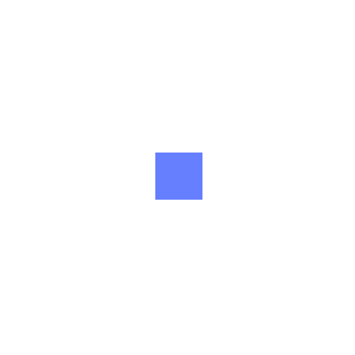

# LP_Plugin_SoftActorCritic

The Gym implemented CartPole for 1D and 2D continuous.

1D _action_: `[ -1 < x < 1 ]`

1D _state_ : `[ position, velocity, angle, angular velocity ]`

1D _done_ : `-threshold > position` or `threshold < position` or `-ang_thres > angle` or `ang_thres < angle`

2D _action_: `[ -1 < x < 1, -1 < y < 1 ]`

2D _state_ : `[ position_x, velocity_x, angle_x, angular velocity_x, position_y, velocity_y, angle_y, angular velocity_y ]`

The example shown below uses vision-based version of 2D continuous CartPole.

The CartPole VisionContinuous does not limit the cart position and linear velocity. So the cart is moving in an infinite plane or sphere (with centrepedal neglected) as shown by the example. The `state` of the cart is transferred to an image for RL models.
The vision-based version cannot be used directly. A callback renderer function is needed which maybe provided in the future.

Example

The states input show from the top-view (128x128). 

The color (Depth as alpha not shown here) input only.

The following scaled to 512x512 for illustration.

